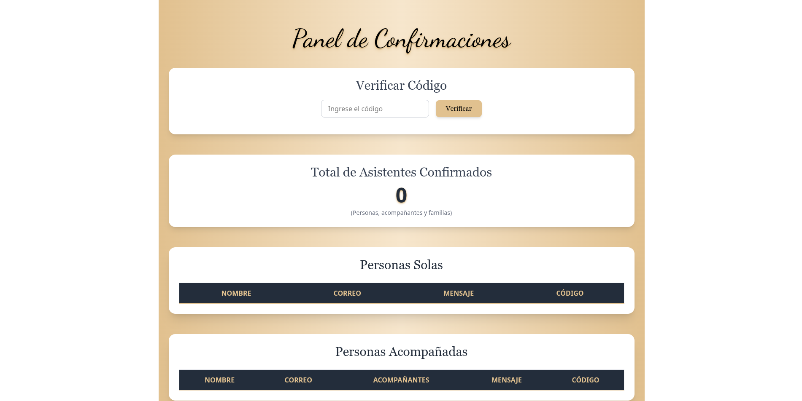

# 🎉 Invitación Digital – XV Años de Guadalupe

Sitio web interactivo para celebrar los **XV años de Guadalupe**. Incluye una página de invitación con detalles del evento, un sistema de confirmación de asistencia y un panel de administración para gestionar las respuestas de los invitados.

  

## ✨ Características

- **Invitación digital** elegante y responsiva.
- **Detalles del evento**: fecha, hora, ubicación de ceremonia y recepción.
- **Agradecimientos** a padres y padrinos.
- **Galería de fotos** (“Recuerdos Dorados”).
- **Sistema de confirmación** con tres modalidades:
  - Persona sola
  - Persona acompañada
  - Familia (varios integrantes)
- **Panel de administración** protegido por código:
  - Visualización de todas las confirmaciones agrupadas por tipo.
  - Conteo total de asistentes.
- **Despliegue en Vercel** para fácil acceso y rendimiento.

## 🛠️ Tecnologías utilizadas

- **Frontend:** HTML5, CSS3, JavaScript, Astro, TailwindCSS
- **Base de datos:** Supabase
- **Despliegue:** [Vercel](https://vercel.com)
- **Control de versiones:** Git + GitHub
